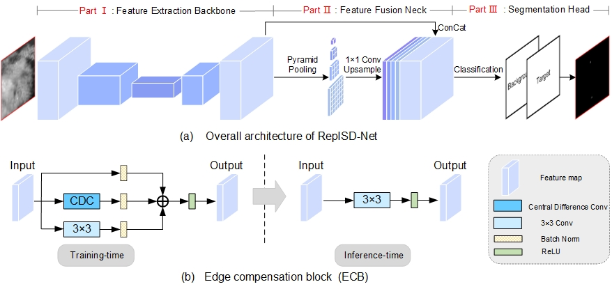
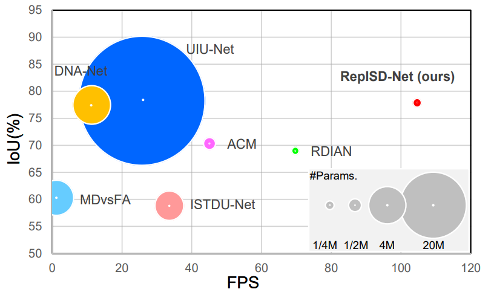
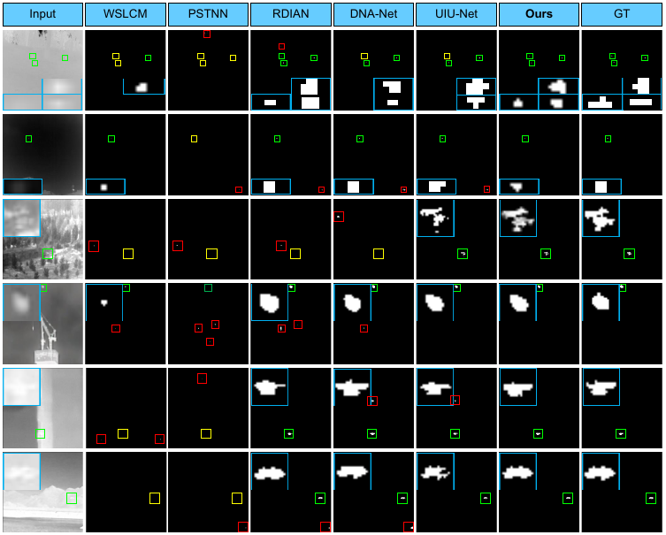

# Learning an Efficient Infrared Small Target Detection Network via Structural Re-parameterization

Our paper has been accepted by IEEE Transactions on Geoscience and Remote Sensing.

We will release more interesting works about lightweight networks on infrared small target detection.

Welcome to keep following our repository.



## Algorithm Introduction

Learning an Efficient Infrared Small Target Detection Network via Structural Re-parameterization

Authors: Shuanglin Wu, Chao Xiao, Longguang Wang, Yingqian Wang, Jungang Yang, Wei An.

We propose a powerful yet efficient network (RepISD-Net) for infrared small target detection to achieve high detection performance with a fast inference speed. 
Experiments on three public (e.g., NUAA-SIRST, NUDT-SIRST, and IRSTD-1k) datasets demonstrate the effectiveness and efficiency of our method. 
The contribution of this paper are as follows:

1. We make the first attempt to explore the balance between detection performance and inference speed, and proposed a simple re-parameterized network (RepISD-Net) for infrared small target detection.

2. We design a multi-branch topology, i.e., edge compensation block (ECB), tailored for infrared small targets to incorporate their contour and edge information for the feature enhancement.

3. Compared with other SOTA methods, our RepISD-Net can achieve comparable or even better detection performance with significantly accelerated inference speed.



## Prerequisite
* Tested on Ubuntu 20.04, with Python 3.8, PyTorch 1.12, Torchvision 0.13.1, CUDA 11.7, and 1x NVIDIA 3090.

* [The NUAA-SIRST download dir](https://github.com/YimianDai/sirst) [[ACM]](https://arxiv.org/pdf/2009.14530.pdf)

* [The NUDT-SIRST download dir](https://pan.baidu.com/s/1WdA_yOHDnIiyj4C9SbW_Kg?pwd=nudt) (Extraction Code: nudt)[[DNA-Net]](https://arxiv.org/pdf/2106.00487v3.pdf)

* [The IRSTD-1k download dir](https://github.com/RuiZhang97/ISNet) [[ISNet]](https://openaccess.thecvf.com/content/CVPR2022/papers/Zhang_ISNet_Shape_Matters_for_Infrared_Small_Target_Detection_CVPR_2022_paper.pdf)

## Usage

#### Data preparation:
    Download NUAA-SIRST, NUDT-SIRST and IRSTD-1k, put them to ./data

#### step1. Train the training-time model.
```bash
python train.py   --dataset NUAA-SIRST     --convert Fasle  --deploy  False  --batch_size 16  --epochs 500
```

#### step2.Test the training-time model and convert the CDC branch.
```bash
python test.py  --dataset NUAA-SIRST   --convert True  --deploy False --model_dir NUAA-SIRST_RepISD_Net_01_02_2023_14_06_49_wDS/mIoU__RepISD_NUAA-SIRST_best.pth.tar  
```

#### step3. Then we need to convert weights and merge the training-time model into the inference-time model
```bash
python ./convert_tool/deploy_ECB.py --load [CDC-branch convertd model dir]  --save [to save the deployed model path] -  --convert True  --deploy  False
```

#### step4.Test the inference-time model
```bash
python test.py  --model_dir NUAA/deploy.pth.tar  --dataset NUAA-SIRST   --convert True  --deploy  True
```

#### (Optional 1) Visulize your predicts.
```bash
python vis.py    --model_dir NUAA/deploy.pth.tar  --dataset NUAA-SIRST  
```

#### (Optional 2) Demo (with your own IR image).
```bash
python demo.py  --img_demo_dir demo_img  --img_demo_index Misc_413 
```

## Results and Trained Models
#### Qualitative Results



#### Quantative Results 

on NUAA-SIRST

| Model            | IoU (%) | Pd (%) | Fa (x10(-6)) |
|------------------|---------------|--------------|--------------|
| RepISD-Net    | 77.81         | 100.00       | 4.22         |

on NUDT-SIRST

| Model            | IoU (%) | Pd (%) | Fa (x10(-6)) |
|------------------|---------------|--------------|--------------|
| RepISD-Net    | 89.44         | 98.65        | 6.18         |

on IRSTD-1k

| Model            | IoU (%) | Pd (%) | Fa (x10(-6)) |
|------------------|---------------|--------------|--------------|
| RepISD-Net    | 65.45         | 91.59        | 7.62         |

model efficiency

| Model            | #Params(M) | FLOPs(G) | FPS    |
|------------------|:----------:|-------|--------|
| RepISD-Net    |    0.28    | 25.76 | 104.64 |

Note that:
FLOPs/FPS  are calculated/tested on an input image with a resoulution of 512✖512.


